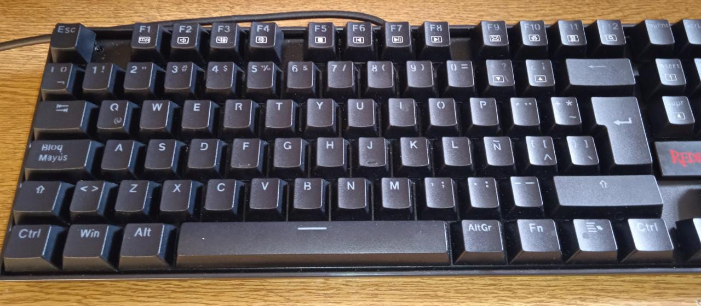

# Keyboard Custom Layer

Modificación manual del teclado layout de Ubuntu, para ser usado por un teclado en español no compatible.

Modificación compatible con:

- Redragon K552RGB-1
- Ubuntu 18

# Quickstart:

1. Entrar al directorio /usr/share/X11/symbols

```shell
$cd /usr/share/X11/xkb/symbols
```

2. Abrir el archivo "es", modificaremos el archivo de los teclados en ESpañol.

```shell
$cd sudo nano es
```

3. Dentro del archivo "es" modifica las siguientes líneas.

- Esto primero es para cambiar la configuración general de todos los layer en español.
- Observar que la tecla "BKSL" luego sera sobre escrita por el tipo específico de teclado que usaremos.

```C++
default  partial alphanumeric_keys
xkb_symbols "basic" {
    include "latin(type4)"

    name[Group1]="Spanish";

    key <AE01>	{ [         1,     exclam     ,exclam  , exclam       ]	};
    key <AE03>	{ [         3,   numbersign,   numbersign, numbersign ]	};
    key <AE04>	{ [         4,     dollar,   asciitilde,       dollar ]	};
    key <AE06>	{ [         6,  ampersand,      ampersand, ampersand  ]	};
    key <AE11>	{ [apostrophe,   question,    backslash, questiondown ]	};
    key <AE12>	{ [questiondown,   exclam,       exclam,       exclam ]	};

    key <AD11>	{ [dead_grave, dead_circumflex, bracketleft, dead_abovering ] };
    key <AD12>	{ [      plus,   asterisk, bracketright,  dead_macron ]	};

    key <AC10>	{ [    ntilde, Ntilde,   asciitilde, dead_doubleacute ]	};
    key <AC11>	{ [dead_acute, dead_diaeresis, braceleft,   braceleft ]	};
    key <TLDE>	{ [ bar,masculine, ordfeminine,notsign ]	};

    key <BKSL>	{ [  ccedilla,   Ccedilla,   braceright,   dead_breve ]	};

    include "level3(ralt_switch)"
};
```

- Esto segundo es para cambiar el layer en especifico llamado **Spanish (no dead keys)**

```C++
partial alphanumeric_keys
xkb_symbols "nodeadkeys" {

    include "es(basic)"

    name[Group1]="Spanish (no dead keys)";

    key <AD11>	{ [     acute, diaeresis,diaeresis,diaeresis ]	};
    key <AD12>	{ [      plus,   asterisk, asciitilde,       macron ]	};
    key <AC10>	{ [    ntilde,     Ntilde,   asciitilde,  doubleacute ]	};
    key <AC11>	{ [    braceleft, bracketleft, asciicircum, asciicircum ] };
    key <BKSL>	{ [   braceright, bracketright,grave,grave ]};
    key <AB10>	{ [     minus, underscore, dead_belowdot,    abovedot ]	};

    key <AD01>  { [         q,          Q,            at,          at ] };
    key <LSGT> {[       less, greater, guillemotleft, guillemotright    ]};
    key <AC01> { [         a,          A,        aacute,           Aacute ] };
    key <AD03> { [         e,          E,        eacute,           Eacute ] };
    key <AD08> { [         i,          I,        iacute,           Iacute ] };
    key <AD09> { [         o,          O,        oacute,           Oacute ] };
    key <AD07> { [         u,          U,        uacute,           Uacute ] };
};
```

4. Luego guardar los cambios y finalmente reiniciar su sesión de usuario de ubuntu.

# Comprendiendo el código del teclado modificado.

1. Las teclas pueden ser encontradas como un arrego de matrices, en la tabla se indica como es que estas se ordenan en el teclado.
<center>

| Row name | Primera tecla de la fila | inicio | final |
| :------- | :----------------------- | :----- | :---- |
| AE       | 1                        | 01     | 12    |
| AD       | q                        | 01     | 12    |
| AC       | a                        | 01     | 12    |
| AB       | z                        | 01     | 12    |

</center>

2.  Las funciones de cada tecla se pueden definir dentro de cada corchete, la primera es la funcion primaria, la segunda es la función con shift, la tercera es con la tecla altgr y la cuarta es con shift + altgr

                    {[primaria, shift, altgr, shift+altfr]}

3.  Teclas especiales.
<center>

| Key name | Ubicación en el teclado                                                                      |
| :------- | :------------------------------------------------------------------------------------------- |
| LSGT     | A la izquierda del "z" para el > <                                                           |
| BKSL     | A la izquierda del Enter, en ingles suele ser una tecla grande, en español se vuelve pequeña |
| TLDE     | A la izquierda del número 1                                                                  |

</center>

4. Redragon K522
<center>

</center>

5. Más información en [Ubuntu Documentation](https://help.ubuntu.com/community/Custom%20keyboard%20layout%20definitions?action=show&redirect=Howto%3A+Custom+keyboard+layout+definitions#Unicode_and_alt_codes)
